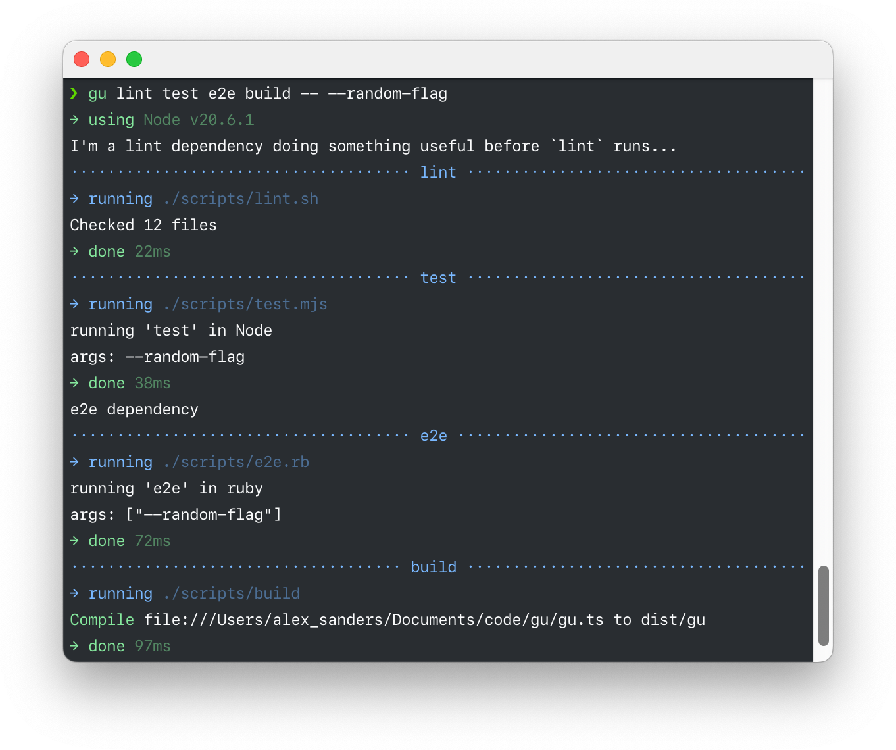

# `gu`

> Experimental task runner, inspired by the Guardian's
> [ergonomic but unorthodox use of `makefile`s](https://github.com/search?q=org%3Aguardian%20.PHONY%3A&type=code).

The idea is to standardise how and where you define project tasks, by making
them:

1. easy to discover
2. simple to run
3. flexible to write

It's inspired by a lot of prior art, especially GitHub's
[Scripts To Rule Them All](https://github.com/github/scripts-to-rule-them-all).

_N.B. while `gu` is only intended to be used by humans (and not by CI systems
etc), it's designed to encourage a style of writing tasks that also makes them
simple to run in CI._

## Screenshot



## Usage

```sh
gu <task> [<task> ...] [-- args...]
```

### Examples

```sh
gu test
```

You can run multiple tasks:

```sh
gu test lint # will be run serially, in order
```

You can pass arguments to individual tasks by quoting them:

```sh
gu test 'lint --cache'
```

You can pass arguments to all tasks by passing them after `--`:

```sh
gu test lint -- --cache
```

Tasks can also be globs:

```sh
gu 'build-*'
gu '**/test'
```

### Helpers

`gu` comes with some built in helpers that can be used in your tasks.

#### `--verify-node`

Ensure the correct version of Node is being used (based on `.nvmrc`).

_More to come..._

### Flags

#### `--list`, `-l`

List all available tasks in the current directory.

#### `--help`, `-h`

Show help.

#### `--version`, `-v`

Show the version number.

## Tasks

Tasks are any executable files that live in the `./scripts` directory.

> Note that file extensions are ignored by `gu`, so having both `lint.rb` and
> `lint.mjs` would throw an error. However, using them can help with editor
> integration.

### Example

```sh
.scripts/
├── build.mjs #!/usr/bin/env node
├── lint      #!/usr/bin/env ruby
└── test      #!/usr/bin/env bash
```

Now you can run:

```sh
gu lint test build
```

### Special Tasks

Gu will also run any relevant `before-*`/`after-*` scripts it finds in
`./scripts/.gu/`.

For example, if you run `gu build`, it will try to run the following:

1. `./scripts/.gu/before-all`
2. `./scripts/.gu/before-build`
3. `./scripts/build`
4. `./scripts/.gu/after-build`
5. `./scripts/.gu/after-all`

You can use this feature to set up your environment before running a task, or to
clean up afterwards etc.

## Development

You will need Deno. See [deno.land](https://deno.land) for more information.

While developing, instead of running `gu` you can run `./gu.ts` instead.

### Building

To build `gu`, run the project's build script using `gu` itself:

```sh
./gu.ts build
```
